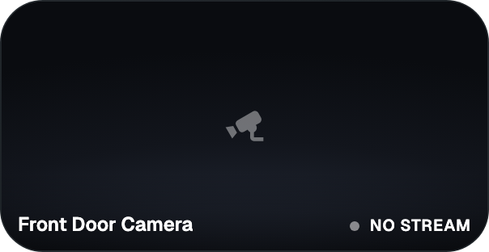
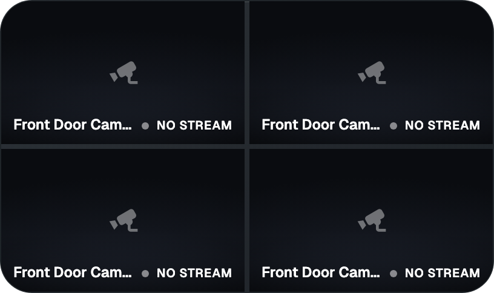

# Cameras widget for GlassHome

Your Home Assistant cameras live on the dashboard. One camera, two side by
side, four in a grid, or every configured camera in turn with a crossfade.





## What it does

- Pick any number of cameras; their order is the order on the tile.
- Layout `Single`, `Side by side`, `Grid 2x2` or `Rotate all`, with a
  per-camera interval for rotation.
- Motion and doorbell: sensors that live on the same Home Assistant device as a
  camera (`binary_sensor` and `event` entities with a motion, occupancy or
  doorbell class) are found automatically. When one fires the camera comes on
  screen with a badge and stays for the hold time. A doorbell is not pushed
  aside by motion elsewhere.
- Tap the tile for the next camera and it holds there for the same time. Hold
  the tile for a large view with previous, next, a sound toggle and the
  settings tab.
- Picture `Fill` (crop), `Fit` (whole picture with bars), or fill anchored to
  the top or bottom of the frame.
- Camera name, a pulsing LIVE dot, `REC` while recording, and for stills how
  many seconds old the picture is. The dot goes grey and the text explains when
  a camera is off, unavailable or only delivers stills.
- Streams stop when the tile is scrolled off screen or the tab is hidden, and
  start again when it comes back.
- English, Dutch, German and French, picked from the browser locale.

## How the picture gets there

Each camera walks a ladder and drops one rung whenever a route fails or shows
no frame within 8 seconds:

1. **WebRTC** when Home Assistant reports `frontend_stream_type: web_rtc`.
   Native `RTCPeerConnection`, lowest latency, no library.
2. **HLS** through the HA stream integration. Native on Safari and iOS,
   hls.js elsewhere. hls.js requests go through the host's media proxy, so the
   HA origin never has to allow cross-origin fetches.
3. **MJPEG** from `camera_proxy_stream`, which HA offers for every camera. Read
   with `fetch` and split into JPEGs by hand: a browser `` only shows a
   multipart part once the next boundary arrives, and HA sends a new part only
   when the picture changes, so a still camera would sit on a black tile.
4. **Snapshot** from `entity_picture`, refreshed every 10 seconds.
5. A still placeholder.

A stream that played and then died reconnects from the top after 3 seconds; a
video that stops advancing for 12 seconds counts as died; a camera on the
placeholder is retried once a minute.

Rotation mounts the next camera hidden and swaps on its first frame, so a slow
camera never leaves a black gap.

This widget owns its visual surface: the `<Widget>` shell stays neutral and the
video fills it edge to edge, per the SDK's escape pattern for video widgets.

## Development

```bash
bun install
bun test          # the pure ladder, url and index maths, sensor lookup, locale parity
bun run build
bunx glasshome-widget preview
bunx glasshome-widget connect <dashboard-url>
```

The Hub's demo camera has nothing behind it, so previews render the placeholder
frame with the overlay rather than waiting on a stream.
