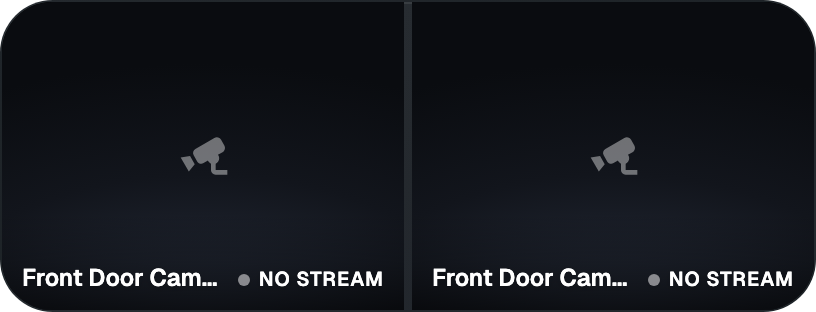

# Cameras widget for GlassHome

Your Home Assistant cameras live on the dashboard. One camera, two side by
side, or every configured camera in turn with a crossfade.




## What it does

- Pick any number of cameras; their order is the order on the tile.
- Layout `Single`, `Side by side` or `Rotate all`, with a per-camera interval
  for rotation.
- Tap the tile for the next camera, hold it for a large view with previous and
  next, and the settings tab.
- Camera name and a pulsing LIVE dot over the picture; the dot goes grey and
  the text explains when a camera is off, unavailable or only delivers stills.
- Streams stop when the tile is scrolled off screen or the tab is hidden, and
  start again when it comes back.
- English, Dutch, German and French, picked from the browser locale.

## How the picture gets there

Each camera walks a ladder and drops one rung whenever a route fails or shows
no frame within 8 seconds:

1. **WebRTC** when Home Assistant reports `frontend_stream_type: web_rtc`.
   Native `RTCPeerConnection`, lowest latency, no library.
2. **HLS** through the HA stream integration. Native on Safari and iOS,
   hls.js elsewhere. hls.js requests go through the host's media proxy, so the
   HA origin never has to allow cross-origin fetches.
3. **MJPEG** from `camera_proxy_stream`, which HA offers for every camera.
4. **Snapshot** from `entity_picture`, refreshed every 10 seconds.
5. A still placeholder.

Rotation mounts the next camera hidden and swaps on its first frame, so a slow
camera never leaves a black gap.

This widget owns its visual surface: the `<Widget>` shell stays neutral and the
video fills it edge to edge, per the SDK's escape pattern for video widgets.

## Development

```bash
bun install
bun test          # the pure ladder, url and index maths, locale parity
bun run build
bunx glasshome-widget preview
bunx glasshome-widget connect <dashboard-url>
```

The Hub's demo camera has nothing behind it, so previews render the placeholder
frame with the overlay rather than waiting on a stream.
